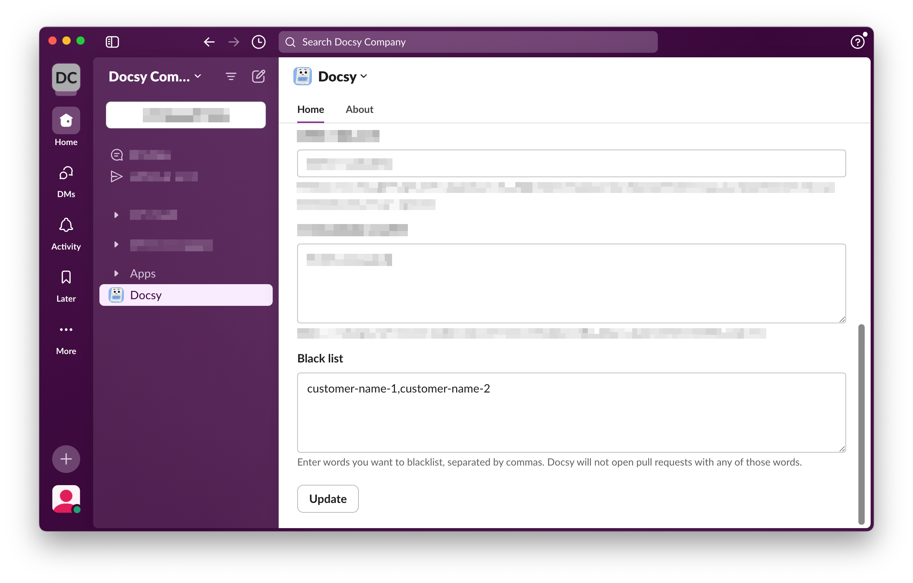

# Data Privacy

## Which data does Docsy store?
Docsy stores your Slack Team identifier together with the settings you configure in app home. Docsy will not store any of your other data, nor will we use any other data for training. Docsy will be active only when you invoke it, and it will then extract and analyze only data relevant to the executed command.

## How does Docsy ensure sensitive data is protected?
Docsy allows you to define a blacklist. If a word that is on the blacklist appears in Docsy's suggestions, Docsy will inform you that it failed to open a PR. This helps prevent sensitive information, such as customer names, from being exposed. 

## Where is Docsy hosted?
Docsy is hosted in Frankfurt am Main, Germany.