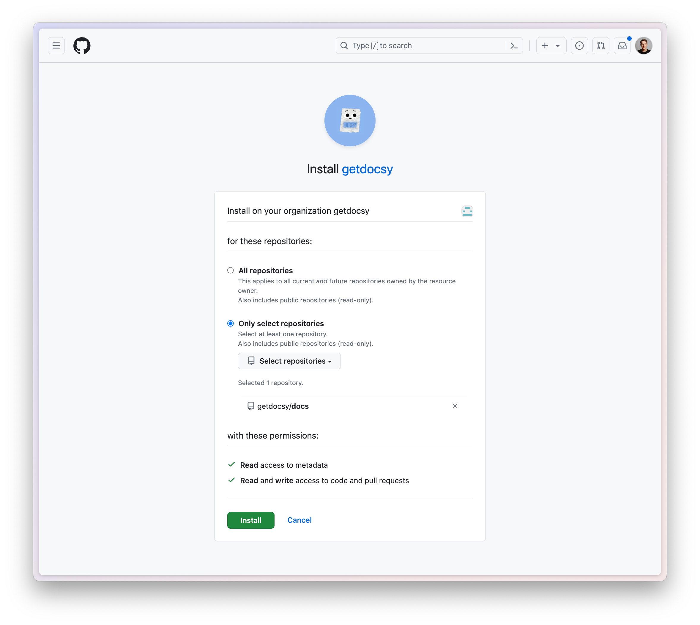

# Getting Started

## Install the Docsy Slack App

Go to [getdocsy.com](https://getdocsy.com). The website has a Slack button that you can use. After installation, add Docsy to channels by @-mentioning it.

## Install Docsy GitHub App

Go to the [Docsy GitHub App page](https://github.com/apps/getdocsy) and follow the instructions there. You will need to choose the repository that Docsy will need access to.

## Configure Docsy in the Slack App Home

You can configure Docsy via the Slack App Home. Go to the App section in Slack, find Docsy, and access the configuration tab.

