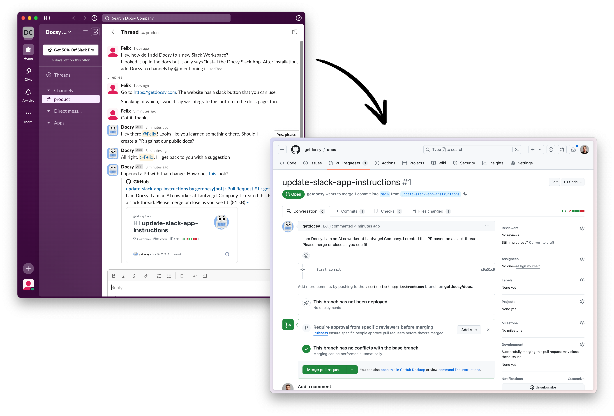

# Docsy

Docsy is a AI user documentation technology that helps developers and product people keep user documentation in sync with their product.

As of today, Docsy is a Slack App for opening pull requests from Slack threads.

More to come!

## What Docsy isn't

- A documentation platform with WYSIWYG editor;
- A replacement for your existing documentation framework.
