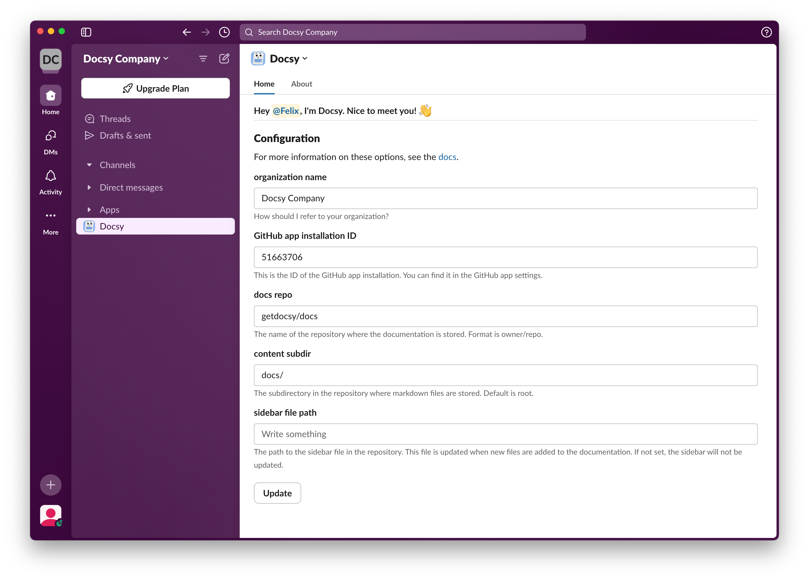

```markdown
# Welcome to Docsy

Docsy is an AI coworker that suggests changes to product documentation based on Q&A threads from Slack.



Unlike full-blown documentation platforms like [readme.com](http://readme.com) or [gitbook.com](http://gitbook.com), which force you to migrate your docs to their platform and cost hundreds of dollars per month to keep running, Docsy simply opens PRs against your existing documentation git repo. No lock-in, just great docs.
```