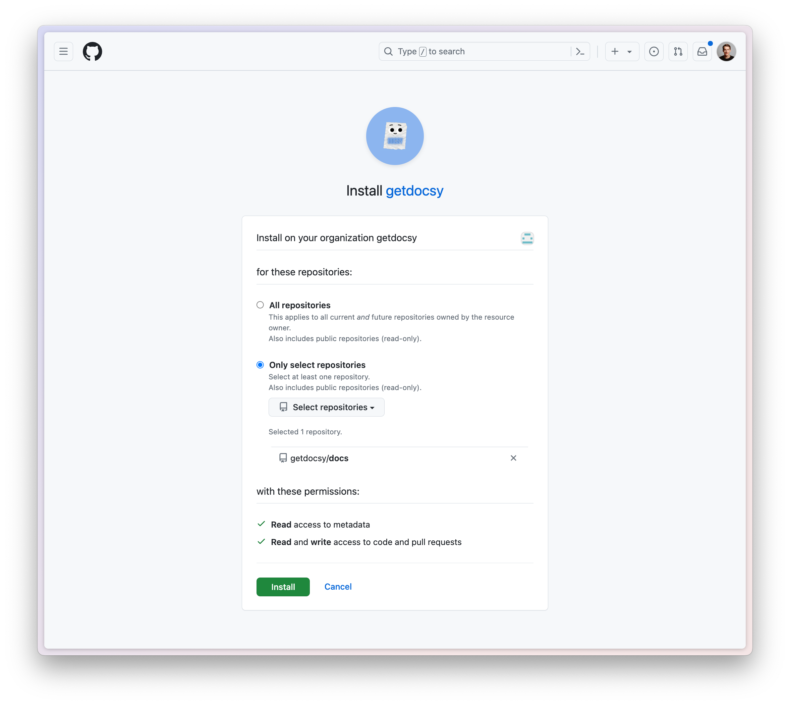

# GitHub App

Docsy offers a GitHub App that allows Docsy engine to interact with your repositories independently from the CLI or CI/CD.

## Install Docsy GitHub App

Go to the [Docsy GitHub App page](https://github.com/apps/getdocsy) and follow the instructions there. You will need to choose the repository that Docsy will need access to.

## Pull Request Reviews

When Docsy is installed in GitHub, it can enhance the pull request review process. Below is an example of how it looks when Docsy reviews a pull request:

