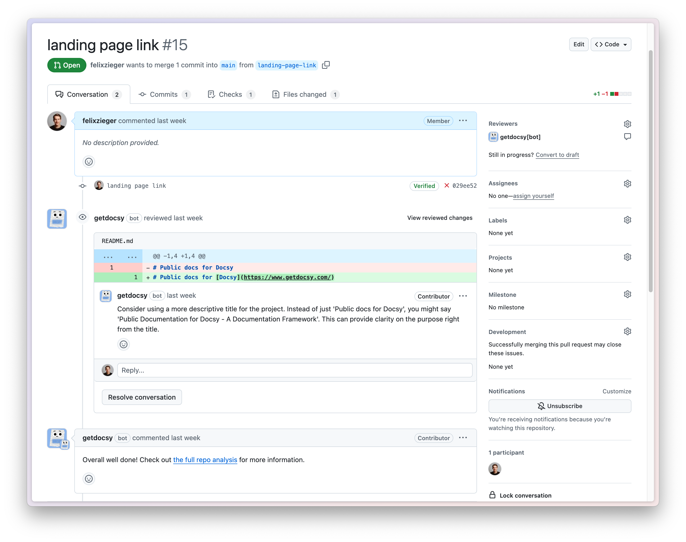

# GitHub App

Docsy offers a GitHub App that allows Docsy engine to interact with your repositories independently from the CLI or CI/CD.

**Note:** The CLI feature was an experimental tool that has been discontinued and is no longer available. It was removed to avoid confusion for users.

## Install Docsy GitHub App

Go to the [Docsy GitHub App page](https://github.com/apps/getdocsy) and follow the instructions there. You will need to choose the repository that Docsy will need access to.

## Pull Request Reviews

When Docsy is installed in GitHub, it can enhance the pull request review process. Below is an example of how it looks when Docsy reviews a pull request:

**Note:** Pull request reviews are optional and currently in beta. You do not have to use them if you prefer not to.