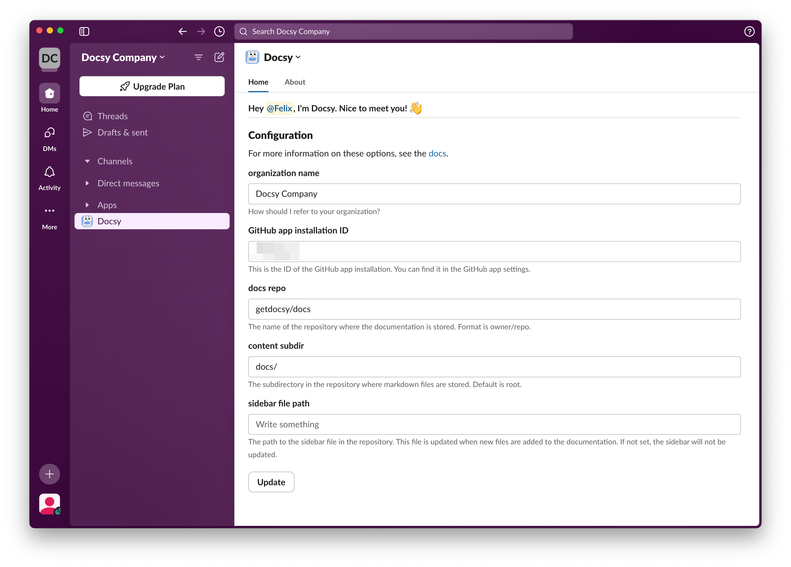

# Slack

Docsy offers a Slack App that allows you to open pull requests for your documentation directly from Slack.

## Install the Docsy Slack App

Add the Docsy Slack App to your workspace via the button below.

Slack will ask you to authorize the installation.

After installation, add Docsy to channels by @-mentioning it.

## Configure Docsy in the Slack App Home

You can configure Docsy via the Slack App Home. Go to the App section in Slack, find Docsy, and access the configuration tab.

## Testing Docsy

After you added Docsy to a channel, mention @Docsy in a thread. If everything is properly set up, Docsy will offer to create a PR for you.

## Chat Privately with Docsy

Besides mentioning Docsy in threads within public channels, you can also chat with Docsy directly. Here is how you do that:
1. Under Apps, find Docsy and open the Messages Tab.
2. Describe what you want to add to the documentation.
3. Docsy may ask further questions in a thread of the original message. Answer those questions within the thread to help Docsy come up with a useful suggestion.
4. Docsy offers to create a pull request with the information found in the thread.  
5. Docsy will include a link to the PR it creates, allowing you to easily access it.